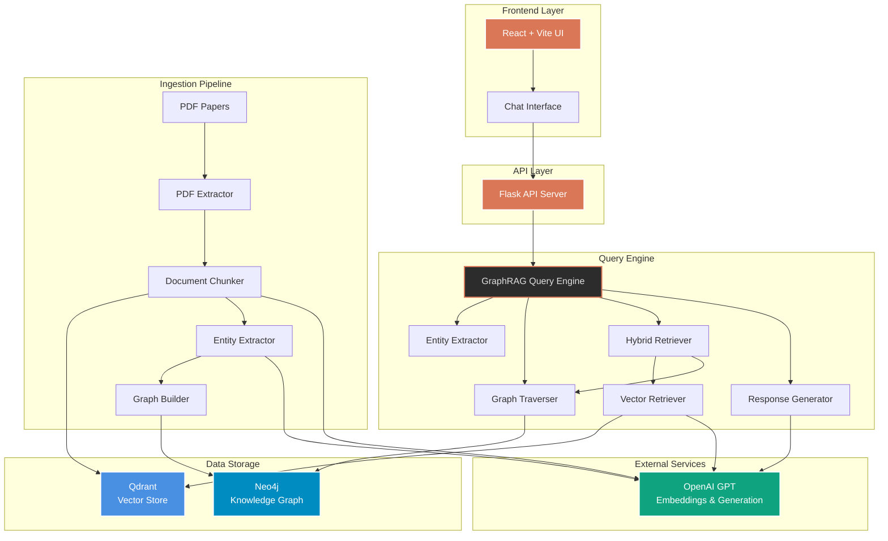
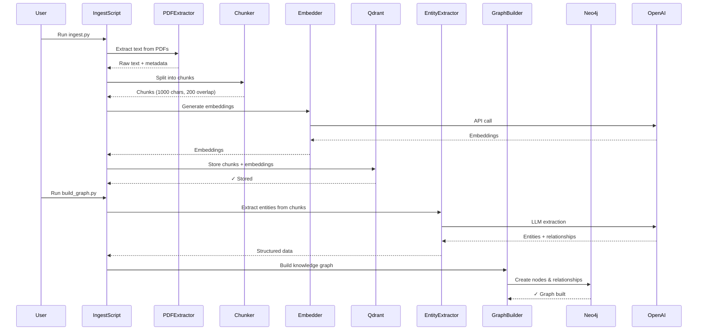
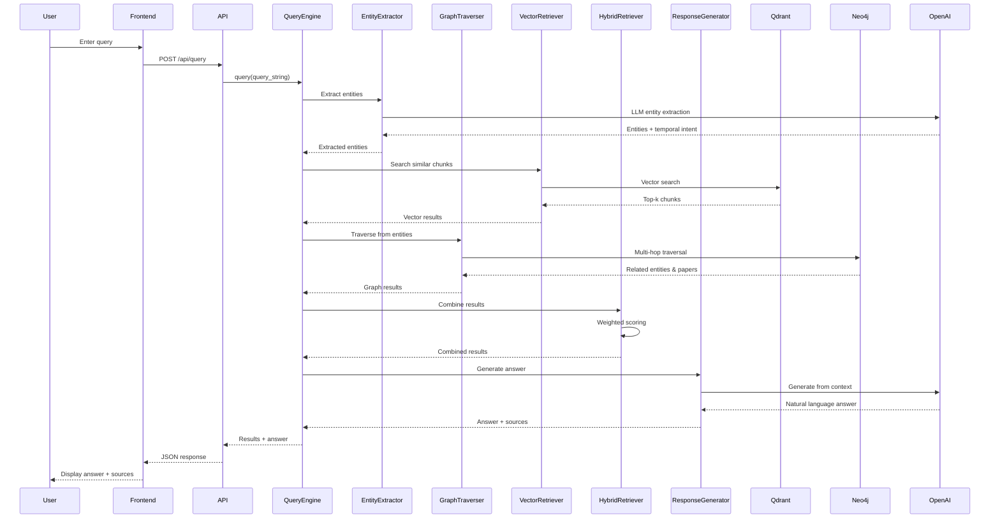
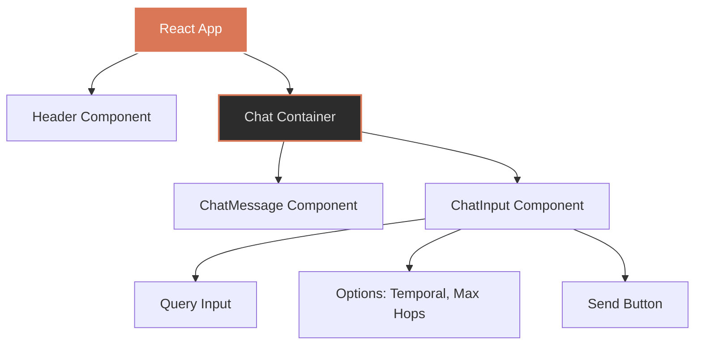
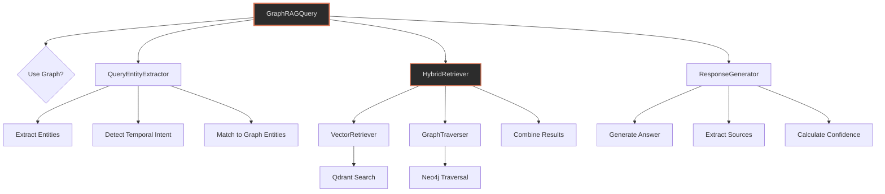
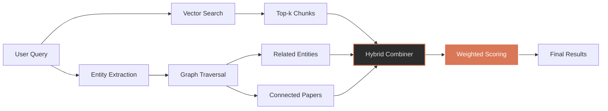
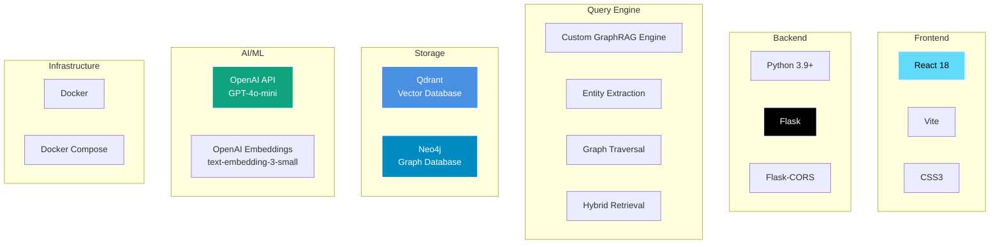
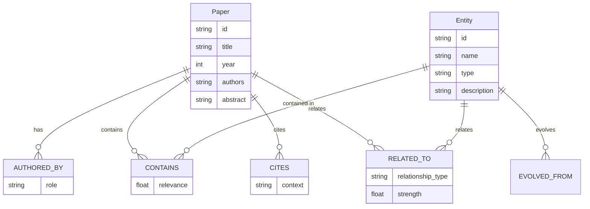
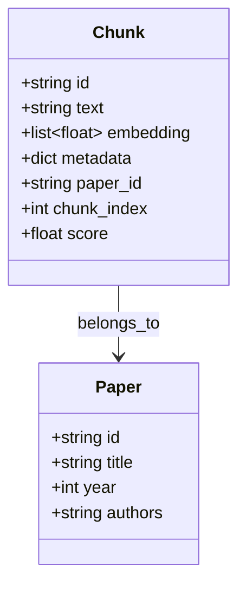
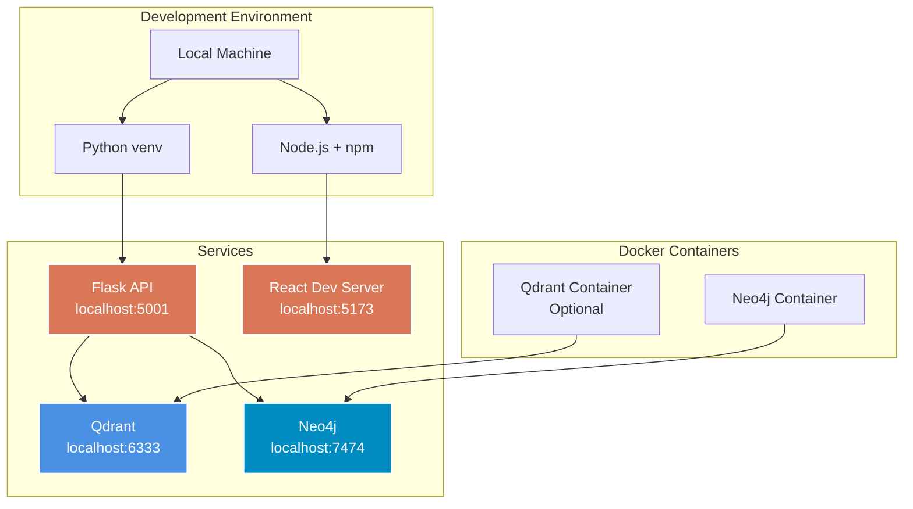

# GraphRAG System Architecture

## System Overview

This document provides a comprehensive architecture diagram of the GraphRAG system, showing data flow, components, and interactions.

## High-Level Architecture

## Data Flow: Ingestion Pipeline

## Data Flow: Query Pipeline

## Component Details

### 1. Frontend Layer

### 2. Query Engine Architecture

### 3. Hybrid Retrieval Process

## Technology Stack

## Data Models

### Knowledge Graph Schema

### Vector Store Schema

## System Deployment

## Key Features

1. **Hybrid Retrieval**: Combines vector similarity (60%) with graph relationships (40%)
2. **Multi-hop Reasoning**: Traverses up to 3 hops in the knowledge graph
3. **Temporal Filtering**: Queries by publication year or year ranges
4. **Entity Extraction**: Automatically extracts entities from queries
5. **LLM Response Generation**: Generates natural language answers from retrieved context
6. **Strict Context Adherence**: Ensures responses are based only on retrieved context
7. **Source Attribution**: Provides citations and confidence scores

## Performance Characteristics

- **Vector Search**: ~50-100ms per query
- **Graph Traversal**: ~100-200ms per query (depends on hop depth)
- **LLM Generation**: ~1-3s per response (depends on model)
- **Total Query Time**: ~1.5-3.5s end-to-end

